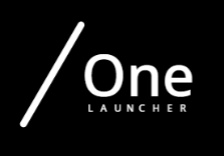

  

<h1 align="center">One Launcher (ONEL) v1.0</h1>

  
  
  
  

---

## 🌟 One Launcher Nedir?

**One Launcher**, efsanevi **Titan Launcher** temel alınarak geliştirilmiş, sadelik ve performansa odaklanan özel bir Minecraft launcher'ıdır. 

Bu launcher, özellikle **Minecraft 1.8.8** sürümünü en stabil ve hızlı şekilde oynatmak için optimize edilmiştir. Karmaşık ayarlarla uğraşmadan, tek tıkla oyuna girmenizi sağlar.

## 🛠️ Teknik Özellikler & Gereksinimler

One Launcher'ın sorunsuz çalışabilmesi için sisteminizde aşağıdaki bileşenlerin kurulu olması gerekmektedir:

| Bileşen | Gerekli Sürüm | Notlar |
| :--- | :--- | :--- |
| **☕ Java Runtime** | **Java 8 (u401 veya üstü tavsiye edilir)** | Minecraft motorunun çalışması için şarttır. |
| **🖥️ .NET Framework** | **4.8** | Launcher arayüzünün (UI) görüntülenmesi için gereklidir. |
| **🎮 Minecraft** | **1.8.8 (Oyun Dosyaları)** | Launcher, `(kurduğunuz dosya yolu)\onel\game\` klasöründeki dosyaları kullanır. |

## 🚀 Nasıl Kullanılır?

1.  **Kurulum:** Depodaki dosyaları bilgisayarınızda `(kurulduğu yer)\onel\` 'ye kurun.
2.  **Dosya Yapısı:** Klasör yapınızın şu şekilde olduğundan emin olun:
    * `(kurulduğu yer)\onel\OneLauncher.exe` (Arayüz)
    * `(kurulduğu yer)\onel\go.bat` (Ateşleme dosyası)
    * `(kurulduğu yer)\onel\logo.png` (Logo)
    * `(kurulduğu yer)\onel\game\` (Minecraft dosyaları - libraries, native, assets)
3.  **Çalıştırma:** `OneLauncher.exe` dosyasını çalıştırın.
4.  **Başlat:** Açılan parlak mavi pencerede **BAŞLAT** butonuna basın.

## ⚠️ Önemli Uyarılar & Yasal Notlar

> **Microsoft® ve Mojang Studios:** Bu program **Microsoft Corporation** veya **Mojang Studios** ile hiçbir şekilde bağlı değildir, onlar tarafından desteklenmez veya onaylanmaz. Minecraft, Mojang Synergies AB'nin tescilli ticari markasıdır.

> **Sorumluluk:** Bu launcher açık kaynaklıdır ve "olduğu gibi" sunulur. Kullanımdan doğabilecek herhangi bir veri kaybı veya sorundan geliştirici sorumlu tutulamaz.

## 📝 Lisans

Bu proje **MIT Lisansı** altında lisanslanmıştır. Detaylar için `LICENSE` dosyasına bakabilirsiniz.

---

  Geliştirici: <b>lattesiber</b>

# bilgi

yav kurulum dosyası benim yaptığım dosyalara kuriyim mı diyordu buraya kurun:(os yeri):\users\(kullanıcınız)\AppData\Roaming 
